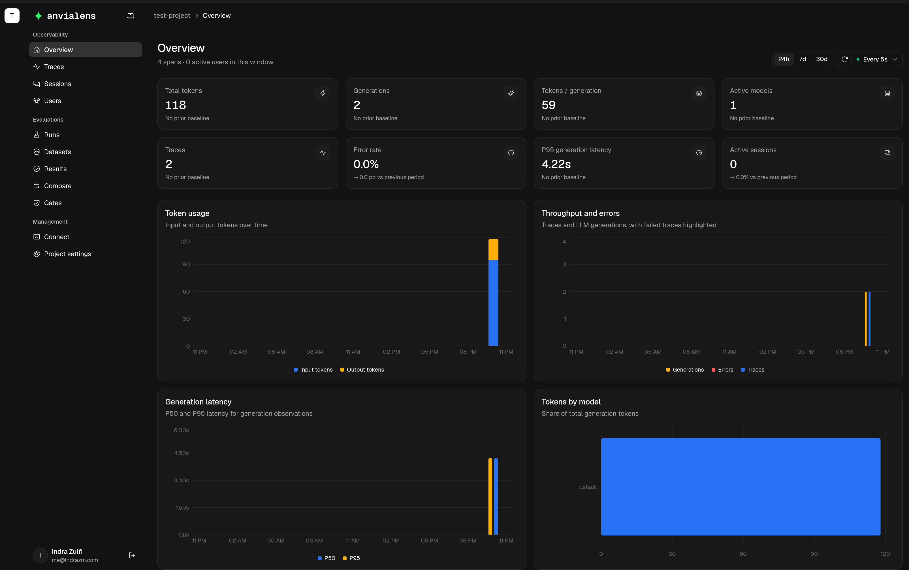

# Anvia Lens

**Self-hosted observability and evaluation for AI agents.**

Anvia Lens brings traces, sessions, evaluation runs, datasets, comparisons, and release gates into
one workspace. It is OpenTelemetry-native, works directly with `@anvia/lens`, and accepts existing
Langfuse OTLP instrumentation.



## What you can do

- Inspect complete agent, generation, and tool traces.
- Review production traces with a shared pass/fail decision and promote failures into dataset drafts.
- Understand latency, token usage, errors, users, and sessions.
- Create in-app alerts for runtime regressions, failed reviews, and failed quality gates.
- Run evaluations and review every case and result.
- Build and publish managed datasets for repeatable tests.
- Compare releases and apply quality gates before shipping.
- Enforce quality gates from CI with the project key pair.
- Connect native Anvia applications or Langfuse-compatible instrumentation.
- Keep all application and telemetry data in your own infrastructure.

## Run with Docker Compose

Lens ships as two public multi-platform images and a production-ready
[`docker-compose.yml`](docker-compose.yml). You only need Docker with Compose support; a source
checkout is not required.

```sh
mkdir lens && cd lens
curl -fsSLO https://raw.githubusercontent.com/anvia-hq/lens/main/docker-compose.yml
curl -fsSL https://raw.githubusercontent.com/anvia-hq/lens/main/.env.example -o .env
```

Open `.env` and configure the public URL and required secrets:

```dotenv
# Pin a release for repeatable deployments.
LENS_VERSION=0.4.0

# Use your HTTPS URL when deploying behind a reverse proxy.
PUBLIC_APP_URL=http://localhost
WEB_ORIGIN=http://localhost
WEB_PORT=80

# Generate a different value for each secret with: openssl rand -hex 32
POSTGRES_PASSWORD=replace-with-a-random-value
CLICKHOUSE_PASSWORD=replace-with-a-random-value
REDIS_PASSWORD=replace-with-a-random-value
BETTER_AUTH_SECRET=replace-with-at-least-32-random-characters
INGESTION_KEY_PEPPER=replace-with-an-independent-random-value
```

Start Lens:

```sh
docker compose up -d
docker compose ps
```

Open <http://localhost>. The first person to create an account becomes the owner, and public account
creation closes automatically after that.

Only the Lens web port is exposed. PostgreSQL, ClickHouse, Redis, the API, the worker, and the
read-only Linux host monitor stay on private Compose networks. Owners and admins can use **System
Health** to inspect current CPU, RAM, disk, dependency, worker, and queue status.

### Production HTTPS with Nginx

Point your domain to the server, install Nginx and Certbot on the host, then change these values in
`.env`:

```dotenv
PUBLIC_APP_URL=https://lens.example.com
WEB_ORIGIN=https://lens.example.com
WEB_PORT=127.0.0.1:8080
```

This keeps Lens private on the host while leaving ports 80 and 443 available for Nginx. Configure
Nginx to forward the public domain to Lens:

```nginx
server {
    listen 80;
    server_name lens.example.com;

    client_max_body_size 10m;

    location / {
        proxy_pass http://127.0.0.1:8080;
        proxy_set_header Host $host;
        proxy_set_header X-Forwarded-For $proxy_add_x_forwarded_for;
        proxy_set_header X-Forwarded-Proto $scheme;
    }
}
```

Enable the site, reload Nginx, and request the certificate:

```sh
sudo nginx -t
sudo systemctl reload nginx
sudo certbot --nginx -d lens.example.com
```

Run `docker compose up -d` after changing `.env`. Do not expose the API on port 3001 or publish the
database and queue ports.

SMTP is optional and is used only for password resets. Leave `SMTP_HOST`, `SMTP_USER`, and
`SMTP_PASSWORD` empty to disable it. Invitations use copyable links and do not require email.

Useful operations:

```sh
docker compose logs -f api worker  # Follow application logs
docker compose restart             # Restart Lens
docker compose down                # Stop Lens and preserve data
```

## Connect an Anvia application

Create a project and key pair from the Lens **Connect** page, then configure your application:

```dotenv
ANVIA_LENS_BASE_URL=http://localhost
ANVIA_LENS_PUBLIC_KEY=pk-lens-...
ANVIA_LENS_SECRET_KEY=sk-lens-...
ANVIA_LENS_SERVICE_NAME=support-agent
ANVIA_LENS_ENVIRONMENT=production
```

```ts
import { createLensEvalReporter, lens } from "@anvia/lens";

export const tracing = lens.create();
export const evalReporter = createLensEvalReporter(tracing);
```

Attach `tracing` to an Anvia agent with `.observe(tracing)`. Pass `evalReporter` to `runEvalSuite`
to correlate evaluation lifecycle events with the traces produced by each case.

See the [native Anvia examples](examples/anvia-agent/README.md) for a live-model path from basic
tracing through tools, evaluations, managed datasets, comparisons, and gates.

## Connect Langfuse instrumentation

Existing `@langfuse/otel` v5 applications can send traces to Lens without changing their
instrumentation. Point the standard Langfuse environment variables at your Lens deployment:

```dotenv
LANGFUSE_BASE_URL=http://localhost
LANGFUSE_PUBLIC_KEY=pk-lens-...
LANGFUSE_SECRET_KEY=sk-lens-...
LANGFUSE_MEDIA_UPLOAD_ENABLED=false
```

These variables also work with `@anvia/langfuse`. Keep media uploads disabled because Lens does not
currently provide Langfuse media storage.

## Upgrade

Back up the `lens-postgres`, `lens-clickhouse`, and `lens-redis` volumes before upgrading. Change
`LENS_VERSION` in `.env`, then run:

```sh
docker compose pull
docker compose up -d
```

The migration container completes before the API and worker start. Do not use
`docker compose down -v` during an upgrade: `-v` permanently deletes the Lens data volumes.

## Local development

The development stack builds the current checkout, exposes infrastructure ports, and includes
Mailpit for local password-reset email:

```sh
cp .env.dev.example .env
docker compose -f docker-compose.dev.yml up --build
```

Open Lens at <http://localhost> and Mailpit at <http://localhost:8025>.

To load a realistic local workspace with traces and evaluations:

```sh
docker compose -f docker-compose.dev.yml run --rm seed
```

Run application services outside containers while keeping infrastructure in Docker:

```sh
docker compose -f docker-compose.dev.yml up -d postgres redis clickhouse mailpit
pnpm install
pnpm db:migrate
pnpm dev
```

Common checks:

```sh
pnpm check
pnpm typecheck
pnpm build
pnpm test
pnpm test:integration
```

The documentation website lives in [`www`](www) and runs separately from the application stack:

```sh
pnpm www:dev
```

Open <http://localhost:4321> while authoring documentation.

## Contributing

Contributions are welcome. Read [CONTRIBUTING.md](CONTRIBUTING.md) before opening a pull request and
follow the [Code of Conduct](CODE_OF_CONDUCT.md) in all project spaces.

## License

Anvia Lens is free software licensed under the
[GNU Affero General Public License Version 3](LICENSE) (`AGPL-3.0-only`). If you modify Lens and
make that version available over a network, you must offer its corresponding source to its users
under the same license.

## Maintainer releases

Update the root `package.json` version, commit it to `main`, and wait for CI to pass. Then open
**Actions → Create release → Run workflow**, select `main`, and enter the version without the `v`
prefix.

The release workflow:

1. Confirms the version matches `package.json`, the tag is unused, and CI is green.
2. Publishes versioned AMD64 and ARM64 backend and web images.
3. Starts the production Compose stack from those published images.
4. Verifies the live, ready, and web endpoints.
5. Promotes the verified images to `major.minor` and `latest`.
6. Creates the Git tag and GitHub Release.

[`publish-images.yml`](.github/workflows/publish-images.yml) remains available as a manual or
tag-triggered recovery path. It performs the same image validation and promotion without creating a
GitHub Release.
