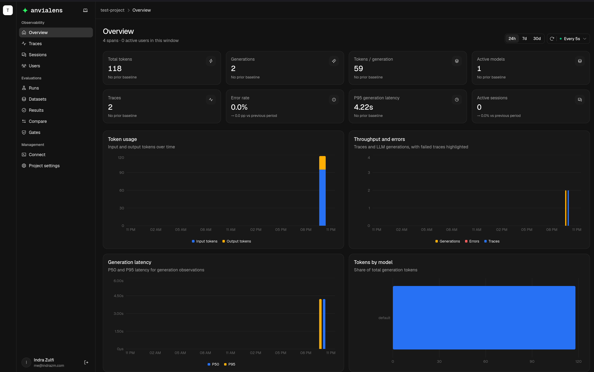

# Anvia Lens

**Self-hosted observability and evaluation for AI agents.**

Anvia Lens brings traces, sessions, evaluation runs, datasets, comparisons, and release gates into
one workspace. It is OpenTelemetry-native, works directly with `@anvia/lens`, and accepts existing
Langfuse OTLP instrumentation.



## What you can do

- Inspect complete agent, generation, and tool traces.
- Review production traces with a shared pass/fail decision and promote failures into dataset drafts.
- Understand latency, token usage, errors, users, and sessions.
- Create in-app alerts for runtime regressions, failed reviews, and failed quality gates.
- Run evaluations and review every case and result.
- Build and publish managed datasets for repeatable tests.
- Compare releases and apply quality gates before shipping.
- Enforce quality gates from CI with the project key pair. See [evidence policies](docs/quality-gate-evidence.md) for per-metric validity requirements.
- Connect native Anvia applications or Langfuse-compatible instrumentation.
- Keep all application and telemetry data in your own infrastructure.

Relative time ranges (24 hours, 7 days, and 30 days) roll forward whenever lists and their
filter options refresh. Automatic refresh preserves the selected filters and page. Choose **Off**
to stop scheduled polling; the users view also supports an unbounded **All time** range.

## Connect an AI assistant with MCP

Owners and admins can create a workspace-wide MCP token from the **MCP Access** page. One token
works across every project in the workspace. Lens exposes a remote Streamable HTTP endpoint at:

```text
https://lens.example.com/api/mcp
```

Configure a remote MCP client with that URL and the one-time token:

```json
{
  "mcpServers": {
    "anvia-lens": {
      "type": "http",
      "url": "https://lens.example.com/api/mcp",
      "headers": {
        "Authorization": "Bearer mcp-lens-..."
      }
    }
  }
}
```

The MCP server is read-only and workspace-wide. It can inspect overview metrics, traces, spans,
sessions, and alert incidents. Every data tool takes a `projectId` argument; call `list_projects`
first to discover the available projects and pass a returned `id` to the other tools. Raw inputs,
outputs, attributes, events, links, and evaluation payloads require both an MCP token created with
**Allow raw payload access** and an explicit `includePayload` argument on the relevant tool call.
Tokens can be revoked immediately and may have an optional expiry.

Upgrading from a Lens release before workspace-wide tokens: previously issued project-scoped MCP
tokens are revoked by the database migration and must be recreated from the **MCP Access** page.

Use HTTPS whenever Lens is available beyond localhost. Clients must support Streamable HTTP and a
static `Authorization` header; OAuth and local stdio connections are not included in this release.
To verify a connection independently, run `npx @modelcontextprotocol/inspector`, select Streamable
HTTP, and enter the endpoint and `Authorization` header shown above.

## Run with Docker Compose

Lens ships as two public multi-platform images and a production-ready
[`docker-compose.yml`](docker-compose.yml). You only need Docker with Compose support; a source
checkout is not required.

```sh
mkdir lens && cd lens
curl -fsSLO https://raw.githubusercontent.com/anvia-hq/lens/main/docker-compose.yml
curl -fsSL https://raw.githubusercontent.com/anvia-hq/lens/main/.env.example -o .env
```

Choose a published version from [Lens releases](https://github.com/anvia-hq/lens/releases) and
confirm its backend and web image publication completed. Pin that numeric version in `.env`;
the repository package version alone does not establish that images have been published. The
release workflow publishes both images with the same version tag (without the `v` prefix).

Open `.env` and configure the public URL and required secrets:

```dotenv
# Replace with the numeric version of a published release (without the v prefix).
LENS_VERSION=<published-version>

# Use your HTTPS URL when deploying behind a reverse proxy.
PUBLIC_APP_URL=http://localhost
WEB_ORIGIN=http://localhost
WEB_PORT=80

# Generate a different value for each secret with: openssl rand -hex 32
POSTGRES_PASSWORD=replace-with-a-random-value
CLICKHOUSE_PASSWORD=replace-with-a-random-value
REDIS_PASSWORD=replace-with-a-random-value
BETTER_AUTH_SECRET=replace-with-at-least-32-random-characters
INGESTION_KEY_PEPPER=replace-with-an-independent-random-value
```

Start Lens:

```sh
docker compose up -d
docker compose ps
```

Open <http://localhost>. The first person to create an account becomes the owner, and public account
creation closes automatically after that.

### Constrained VM profile

For light workloads on a 2 vCPU / 4 GB VM, also download the constrained Compose override:

```sh
curl -fsSLO https://raw.githubusercontent.com/anvia-hq/lens/main/docker-compose.small.yml
docker compose -f docker-compose.yml -f docker-compose.small.yml up -d
```

The override caps steady-state containers at roughly 3.3 GB in total, limits ClickHouse queries to
two threads and 384 MB,
reduces PostgreSQL connections and worker concurrency, bounds retained queue history, rejects new
telemetry with a retryable `503` when 500 ingestion jobs are waiting, and limits OTLP requests to 2
MB. Redis keeps durable `noeviction` behavior with a 256 MB data limit, so accepted queued jobs are
never silently discarded.

This profile is intended for low ingestion volume and short retention. Start with 7 or 14 days of
retention, monitor **System Health**, and use the standard profile or a larger VM if queues remain
backlogged, ClickHouse reaches its query limit, or Redis rejects writes. Keep the same pair of
Compose files in every command, including `pull`, `up`, `logs`, and `down`.

The individual controls are also available in `.env` for custom sizing:
`POSTGRES_MAX_CONNECTIONS`, `CLICKHOUSE_MAX_THREADS`, `CLICKHOUSE_MAX_MEMORY_USAGE_BYTES`,
`CLICKHOUSE_MAX_BYTES_BEFORE_EXTERNAL_GROUP_BY`, `CLICKHOUSE_MAX_BYTES_BEFORE_EXTERNAL_SORT`,
`INGESTION_QUEUE_MAX_WAITING`, the three `WORKER_*_CONCURRENCY` values,
`MATERIALIZE_DELAY_MS`, and the `QUEUE_RETAIN_*` age and count values. A value of zero disables the
ClickHouse and ingestion backlog limits; worker concurrency and retained-job settings must be
positive.

Only the Lens web port is exposed. PostgreSQL, ClickHouse, Redis, the API, the worker, and the
read-only Linux host monitor stay on private Compose networks. Owners and admins can use **System
Health** to inspect current CPU, RAM, disk, dependency, worker, and queue status.

### Production HTTPS with Nginx

Point your domain to the server, install Nginx and Certbot on the host, then change these values in
`.env`:

```dotenv
PUBLIC_APP_URL=https://lens.example.com
WEB_ORIGIN=https://lens.example.com
WEB_PORT=127.0.0.1:8080
```

This keeps Lens private on the host while leaving ports 80 and 443 available for Nginx. Configure
Nginx to forward the public domain to Lens:

```nginx
server {
    listen 80;
    server_name lens.example.com;

    client_max_body_size 10m;

    location / {
        proxy_pass http://127.0.0.1:8080;
        proxy_set_header Host $host;
        proxy_set_header X-Forwarded-For $proxy_add_x_forwarded_for;
        proxy_set_header X-Forwarded-Proto $scheme;
    }
}
```

Enable the site, reload Nginx, and request the certificate:

```sh
sudo nginx -t
sudo systemctl reload nginx
sudo certbot --nginx -d lens.example.com
```

Run `docker compose up -d` after changing `.env`. Do not expose the API on port 3001 or publish the
database and queue ports.

SMTP is optional and is used only for password resets. Leave `SMTP_HOST`, `SMTP_USER`, and
`SMTP_PASSWORD` empty to disable it. Invitations use copyable links and do not require email.

### OpenID Connect (OIDC)

Lens can use a deployment-configured OpenID Connect provider such as Keycloak, Okta, Auth0, or
Microsoft Entra ID. Configure the following values in `.env`:

```dotenv
OIDC_ENABLED=true
OIDC_PROVIDER_ID=oidc
OIDC_DISPLAY_NAME=Company SSO
OIDC_DISCOVERY_URL=https://id.example.com/.well-known/openid-configuration
OIDC_CLIENT_ID=lens
OIDC_CLIENT_SECRET=replace-with-the-oidc-client-secret
OIDC_SCOPES=openid profile email
OIDC_REQUIRE_ISSUER_VALIDATION=false
OIDC_TOKEN_ENDPOINT_AUTH=auto
OIDC_REQUIRE_VERIFIED_EMAIL=false
OIDC_AUTO_PROVISION=true
OIDC_ALLOWED_DOMAINS=example.com
PASSWORD_LOGIN_ENABLED=true
```

Register `${PUBLIC_APP_URL}/api/auth/oauth2/callback/${OIDC_PROVIDER_ID}` as the OIDC callback URL.
`OIDC_TOKEN_ENDPOINT_AUTH` controls how Lens authenticates to the provider's token endpoint: `auto`
(default) follows the provider's own discovery metadata and falls back to the OAuth default
`client_secret_basic` when the metadata is silent; set `basic` or `post` to force a method for
providers whose metadata is wrong. Existing members and users with pending invitations can sign in
through OIDC even when the provider never asserts `email_verified`, because admin intent is what
grants their access. When `OIDC_AUTO_PROVISION=true`, users whose provider-verified email matches
`OIDC_ALLOWED_DOMAINS` join the workspace as members automatically; auto-provisioning always
requires a verified email, since the email domain itself is what grants access. Multiple domains may
be separated by spaces or commas. Set `OIDC_REQUIRE_VERIFIED_EMAIL=true` to additionally require a
provider-verified email for invitations and existing members.

Keep password login enabled until OIDC is confirmed working. Afterward,
`PASSWORD_LOGIN_ENABLED=false` makes OIDC the only login method; the initial owner setup form remains
available on a fresh installation.

Useful operations:

```sh
docker compose logs -f api worker  # Follow application logs
docker compose restart             # Restart Lens
docker compose down                # Stop Lens and preserve data
```

## Connect an Anvia application

Create a project and key pair from the Lens **Connect** page, then configure your application:

```dotenv
ANVIA_LENS_BASE_URL=http://localhost
ANVIA_LENS_PUBLIC_KEY=pk-lens-...
ANVIA_LENS_SECRET_KEY=sk-lens-...
ANVIA_LENS_SERVICE_NAME=support-agent
ANVIA_LENS_ENVIRONMENT=production
```

The verified SDK baseline is `@anvia/core 1.6.1`, `@anvia/lens 1.2.1`, and
`@anvia/openai 1.1.8` (published npm versions checked on 2026-10-06). Install the matching set:

```sh
pnpm add --save-prefix= @anvia/core@1.6.1 @anvia/lens@1.2.1 @anvia/openai@1.1.8 zod@4.6.5
```

Set `OPENAI_API_KEY` and `OPENAI_MODEL`, then use constructor configuration and `generate`:

```ts
import { Agent } from "@anvia/core/agent";
import { LensClient } from "@anvia/lens";
import { OpenAIClient } from "@anvia/openai";

const tracing = new LensClient();
const openai = new OpenAIClient({ apiKey: process.env.OPENAI_API_KEY! });
const agent = new Agent({
  id: "support-agent",
  model: openai.completionModel({ modelId: process.env.OPENAI_MODEL!, api: "chat" }),
  observability: {
    observers: { lens: tracing.observer() },
    primaryTrace: "lens",
  },
});

try {
  const result = await agent.generate({ prompt: "How do refunds work?" });
  if (result.type !== "response") {
    throw new Error(`Agent did not produce a response: ${result.type}`);
  }
  console.log(result.output, result.trace?.traceId);
} finally {
  await tracing.close();
}
```

`close()` flushes and shuts down the client's telemetry providers. Keep the client alive for all
agent and evaluation work. Pass `tracing.evalReporter()` to `runEvalSuite` before closing the client
to correlate evaluation lifecycle events with each case's trace. Safe capture is the default.

See the [native Anvia examples](examples/anvia-agent/README.md) for a live-model path from basic
tracing through tools, evaluations, managed datasets, comparisons, and gates.

Evaluation run inspection loads 100 results per page, with Previous/Next controls. Run and metric
summaries always cover the full run; case summaries, search, and outcome filters cover the current
result page, so a case with multiple metrics can span pages. The run detail API accepts `?page=N`
and returns `resultsPage` metadata. The browser preserves `page` alongside `case` in shared links
and browser history. Older case-only links default to page 1; if that case is absent, inspection
shows an explicit missing-case message instead of selecting a different case. Automatic lookup
of the page containing an older case-only link is not yet supported. Comparisons calculate exact counts for all changed case/metric
pairs and return at most 100 inspection rows, with `caseChangesTruncated` indicating additional
changes. CI gate checks read only aggregate summaries and metrics, without loading case payloads.
For runs linked to a managed dataset, inspection fetches only the published dataset cases
referenced by the current result page (at most 100 distinct case IDs).

The [evaluation benchmark](packages/db/scripts/benchmark-evaluations.ts) exercises synthetic
10k/100k-result runs, standard and constrained ClickHouse settings, and request cancellation. See
[benchmark results and reproduction](docs/evaluation-query-benchmark.md).

## Connect Langfuse instrumentation

Existing `@langfuse/otel` v5 applications can send traces to Lens without changing their
instrumentation. Point the standard Langfuse environment variables at your Lens deployment:

```dotenv
LANGFUSE_BASE_URL=http://localhost
LANGFUSE_PUBLIC_KEY=pk-lens-...
LANGFUSE_SECRET_KEY=sk-lens-...
LANGFUSE_MEDIA_UPLOAD_ENABLED=false
```

These variables also work with `@anvia/langfuse`. Keep media uploads disabled because Lens does not
currently provide Langfuse media storage.

## Upgrade

Back up the `lens-postgres`, `lens-clickhouse`, and `lens-redis` volumes before upgrading. Change
`LENS_VERSION` in `.env`, then run:

```sh
docker compose pull
docker compose up -d
```

The migration container completes before the API and worker start. Do not use
`docker compose down -v` during an upgrade: `-v` permanently deletes the Lens data volumes.

Release maintainers should run the [functional checks and upgrade/restore rehearsal](docs/release-verification.md)
before promotion, including worker-failure controls and preservation of queued telemetry.

## Trace summary convergence

Workers coalesce materialization by project and trace using BullMQ's `keepLastIfActive`
mode (minimum 5.81.3). Arrivals before a delayed read share that read; arrivals during an
active read retain one follow-up with the configured delay. The follow-up survives retry
backoff and is created atomically when the current job completes or exhausts its attempts.
Multiple workers therefore run at most one materialization per trace at once, with at most
one pending follow-up, even during a burst of ingestion.

Convergence assumes acknowledged ClickHouse inserts, successful Redis scheduling, and an
eventually successful materialization attempt. Exhausted failures still need operational
retry; this is not an atomic transaction across stores. When upgrading from stable-ID
materialization jobs, pause producers and drain ingestion and materialization before replacing
all workers; mixed worker versions do not provide this guarantee. Project deletion continues
to fence both ingestion and follow-up materialization writes.

## Deletion and retention boundaries

Project deletion first waits for admitted telemetry writes, marks the project deleting, revokes
its keys, and queues cleanup through the durable outbox. Workers reject accepted or retried jobs
for deleting or missing projects. Cleanup waits for all four ClickHouse table mutations to finish
before removing the project row. If cleanup fails, the deleting row remains, ingestion stays
blocked, and the maintenance job retries; exhausted jobs remain visible in System Health.
Deletion can take longer while a write or ClickHouse mutation is running.

Trace, session, and evaluation-run deletion is a point-in-time cleanup, not a permanent identifier
blocklist. Producers and previously accepted jobs can send those identifiers again. Pause producers
and drain ingestion before deleting individual entities when they must stay absent. Retention
changes update data already stored; pending jobs retain the expiration calculated when accepted,
and ClickHouse TTL cleanup is asynchronous. Drain ingestion before changing retention when all
previously accepted data must receive the new policy, then run the retention update.

The project fence uses PostgreSQL transaction row locks across acknowledged ClickHouse requests;
all API and worker instances must run the fenced implementation. It is not a distributed transaction.
If a PostgreSQL connection disappears while ClickHouse is still executing an unacknowledged write,
stop writers, wait for outstanding ClickHouse queries to finish, and repeat project telemetry cleanup
before treating deletion as verified. Roll out all writers before relying on the fence.

## Local development

The development stack builds the current checkout, exposes infrastructure ports, and includes
Mailpit for local password-reset email:

```sh
cp .env.dev.example .env
docker compose -f docker-compose.dev.yml up --build
```

Open Lens at <http://localhost> and Mailpit at <http://localhost:8025>.

To load a realistic local workspace with traces and evaluations:

```sh
docker compose -f docker-compose.dev.yml run --rm seed
```

Run application services outside containers while keeping infrastructure in Docker:

```sh
docker compose -f docker-compose.dev.yml up -d postgres redis clickhouse mailpit
pnpm install
pnpm db:migrate
pnpm dev
```

Required verification (the same checks run in CI):

```sh
pnpm check
pnpm typecheck
pnpm build
pnpm check:bundle
pnpm test:coverage
pnpm audit:prod
```

`pnpm test:coverage` includes API OIDC account-linking integration tests and starts isolated
PostgreSQL, ClickHouse, and Redis containers with Docker. It removes those containers after the
run. Use `pnpm test` for a faster unit-only check or `pnpm test:integration` for integration-only
iteration; neither replaces the required coverage command.

## Contributing

Contributions are welcome. Read [CONTRIBUTING.md](CONTRIBUTING.md) before opening a pull request and
follow the [Code of Conduct](CODE_OF_CONDUCT.md) in all project spaces.

## License

Anvia Lens is free software licensed under the
[GNU Affero General Public License Version 3](LICENSE) (`AGPL-3.0-only`). If you modify Lens and
make that version available over a network, you must offer its corresponding source to its users
under the same license.

## Maintainer releases

Update the root `package.json` version, commit it to `main`, and wait for CI to pass. Then open
**Actions → Create release → Run workflow**, select `main`, and enter the version without the `v`
prefix.

The release workflow:

1. Confirms the version matches `package.json`, the tag is unused, and CI is green.
2. Publishes versioned AMD64 and ARM64 backend and web images.
3. Starts the production Compose stack from those published images.
4. Verifies the live, ready, and web endpoints.
5. Promotes the verified images to `major.minor` and `latest`.
6. Creates the Git tag and GitHub Release.

[`publish-images.yml`](.github/workflows/publish-images.yml) remains available as a manual or
tag-triggered recovery path. It performs the same image validation and promotion without creating a
GitHub Release.
